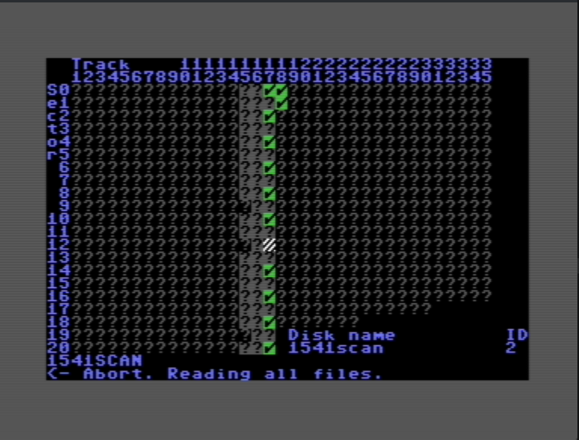
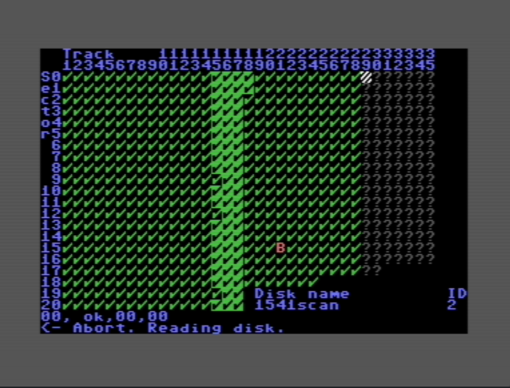

# 1541scan — Inspecting C64 floppy disks for health

This tool is intended to help judging the health of a C64 floppy disk using a 1541 floppy. The user interface is meant to be used quickly, e.g. insert a disk, press F1, let the program do its job, come back some minutes later, and decide yourself what to do.

Limits:
- The tool does not modify the disk (e.g. to try repairing the data).
- The tool is not meant to be fast or small.
- The tool uses the 1541 DOS commands. It does not load a program to the floppy drive. All issues that the Commodore DOS does not find stays hidden.
- The tool doesn't know about copy protections. It doesn't look for sector alignment on tracks, doesn't know more than 35 tracks, can't discern an intentionally weak sector from a corruption etc. This judgement is up to you as a user.

**Key functions**

Design notes

- Sectors that were not read are shown as `?` in a dim gray (`COLOR_GRAY1`).
- Busy sectors (drive or operation busy) are shown with character code `105` and `COLOR_WHITE`.
- "Weak" sectors (different contents on each read) are shown as `W`.
- For normally-read sectors the display character and color come from `dosErrorCharAndColor()`.
- After selecting the character, the code sets or clears the high bit (0x80) to make allocated sectors display as inverse (on C64 the screen charset uses the high bit to invert). Free sectors have the high bit cleared.
- If a sector is allocated but not "used" (or vice versa), the code sets the color to `COLOR_YELLOW` to indicate an inconsistency.

Colors used (approximate, for examples below)

- `COLOR_WHITE`  → #FFFFFF
- `COLOR_GRAY1`  → #AAAAAA
- `COLOR_GREEN`  → #55FF55
- `COLOR_PURPLE` → #AA00AA
- `COLOR_LIGHTRED` → #FF5555
- `COLOR_YELLOW` → #FFFF55
- `COLOR_LIGHTBLUE` → #5555FF

Notes about PETSCII and C64 display

- Characters written to screen memory (`0x400`) use C64 screen/PETSCII codes. The code sometimes writes raw byte values (e.g. `105` or `250`), and then manipulates the high bit to control inverse rendering.
- The README shows glyphs using Unicode/ASCII where practical. The real device will render PETSCII glyphs on a black background.

Encoding table (DOS error -> display)

| DOS constant | Char shown | Meaning / notes | Color |
|--------------|-----------:|------------------|:-----:|
| `DOS_EC_OK` | checkmark (PETSCII 250) | OK / read fine | GREEN |
| `DOS_EC_FILES_SCRATCHED` | R | Files scratched | PURPLE |
| `DOS_EC_READ_ERROR_20` | D | Read error (header) | LIGHT RED |
| `DOS_EC_READ_ERROR_21` | S | Read error (SYNC not found) | LIGHT RED |
| `DOS_EC_READ_ERROR_22` | H | Read error (checksum header) | LIGHT RED |
| `DOS_EC_READ_ERROR_23` | B | Read error (body checksum) | LIGHT RED |
| `DOS_EC_READ_ERROR_24` | C | Read error (checksum) | LIGHT RED |
| `DOS_EC_WRITE_ERROR_DATA` | W | Write error (data block) | PURPLE |
| `DOS_EC_WRITE_PROTECT_ON` | P | Disk write protected | PURPLE |
| `DOS_EC_READ_ERROR_27` | R | Read error | LIGHT RED |
| `DOS_EC_WRITE_ERROR_SYNC` | S | Write error (SYNC) | PURPLE |
| `DOS_EC_ID_MISMATCH` | I | Disk ID mismatch | YELLOW |
| `DOS_EC_SYNTAX_ERROR_MALFORMED` | M | Syntax (malformed) | PURPLE |
| `DOS_EC_SYNTAX_ERROR_UNKNOWN_COMMAND` | C | Syntax (unknown command) | PURPLE |
| `DOS_EC_SYNTAX_ERRPR_COMMAND_TOO_LONG` | L | Command too long | PURPLE |
| `DOS_EC_SYNTAX_ERROR_ILLEGAL_JOKER` | J | Illegal joker | PURPLE |
| `DOS_EC_SYNTAX_ERROR_NO_FILENAME` | N | Filename missing | PURPLE |
| `DOS_EC_FILE_NOT_FOUND_USR` | U | File not found (USR) | PURPLE |
| `DOS_EC_RECORD_NOT_PRESENT` | P | Record not present | PURPLE |
| `DOS_EC_OVERFLOW_IN_RECORD` | Z | Overflow in record | PURPLE |
| `DOS_EC_FILE_TOO_LARGE` | G | File too large | PURPLE |
| `DOS_EC_WRITE_FILE_OPEN` | O | File open during write | PURPLE |
| `DOS_EC_FILE_NOT_OPEN` | X | File not open | PURPLE |
| `DOS_EC_FILE_NOT_FOUND` | Y | File not found | PURPLE |
| `DOS_EC_FILE_EXISTS` | E | File exists | PURPLE |
| `DOS_EC_FILE_TYPE_MISMATCH` | T | File type mismatch | PURPLE |
| `DOS_EC_NO_BLOCK` | B | No block / already occupied | YELLOW |
| `DOS_EC_ILLEGAL_TOS_DISK` | D | Illegal track/sector (disk) | YELLOW |
| `DOS_EC_ILLEGAL_TOS_FILE` | F | Illegal track/sector (file) | YELLOW |
| `DOS_EC_NO_CHANNEL` | A | No channel | PURPLE |
| `DOS_EC_DIR_ERROR` | D | Directory mismatch (DOS vs BAM) | YELLOW |
| `DOS_EC_DISK_FULL` | F | Disk full | PURPLE |
| `DOS_EC_VERSION` | V | CBM DOS version | PURPLE |
| `DOS_EC_DRIVE_NOT_READY` | D | Drive not ready | PURPLE |
| `default` | R | Undefined DOS code | YELLOW |

Colored preview (HTML, view in a browser)

Below is a small HTML table showing colored glyph samples; open this file in a web browser to see colors rendered on a black background. (GitHub flavored Markdown may sanitize inline styles; viewing locally in a browser will show the intended colors.)

<table style="background:#000; color:#fff; border-collapse:collapse;">
	<tr><th style="padding:6px; text-align:left">Sample</th><th style="padding:6px; text-align:left">Meaning</th></tr>
	<tr><td style="padding:6px; color:#55FF55; background:#000;">&#x00FA; (250)</td><td style="padding:6px;">DOS_EC_OK — checkmark — green</td></tr>
	<tr><td style="padding:6px; color:#AA00AA; background:#000;">R</td><td style="padding:6px;">Files scratched / purple</td></tr>
	<tr><td style="padding:6px; color:#FF5555; background:#000;">D</td><td style="padding:6px;">Read error — light red</td></tr>
	<tr><td style="padding:6px; color:#FFFF55; background:#000;">I</td><td style="padding:6px;">ID mismatch — yellow</td></tr>
	<tr><td style="padding:6px; color:#FFFFFF; background:#000;">i (105)</td><td style="padding:6px;">Busy sector — white (uses code 105)</td></tr>
	<tr><td style="padding:6px; color:#AAAAAA; background:#000;">?</td><td style="padding:6px;">Unread sector — gray</td></tr>
</table>

Implementation tips / observations

- The code uses the PETSCII high bit (`0x80`) to mark allocated sectors as inverse. That means the display glyph for allocated sectors will appear inverted on the C64 (foreground/background swapped). The README table shows the logical glyph; the runtime will invert allocated sectors automatically.
-- Some glyphs are numeric character codes (250, 105) rather than ASCII letters; these are PETSCII-specific glyph choices.

## Screenshots

Below are two screenshots captured from the program showing the disk display:

*Figure: Disk display while reading directory entries.*

*Figure: Disk display while scanning empty blocks.*

## License

This tool is distributed under the MIT license. See LICENSE file.

